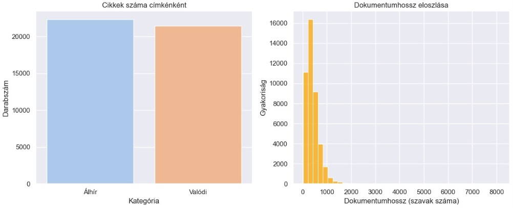
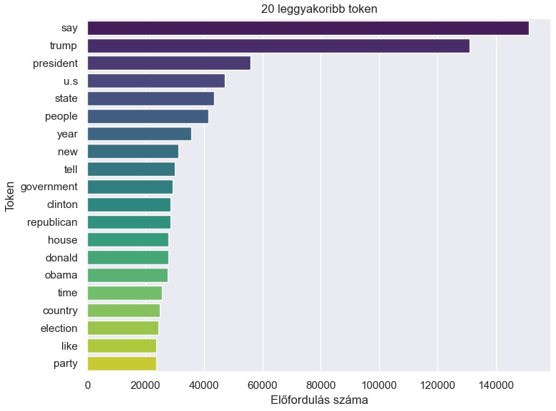
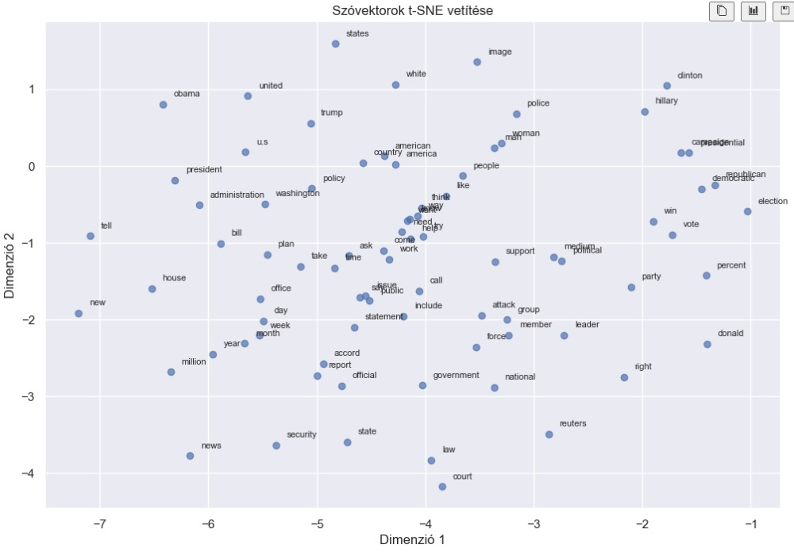
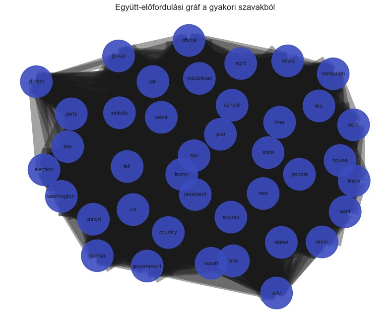

# Fake News Detection – Szövegbányászati és NLP alapú elemzés

Ez a projekt azt mutatja be, hogyan lehet automatikusan megkülönböztetni az álhír jellegű és a valódi híreket. A felhasznált adat a Kaggle „[Fake and Real News Dataset](https://www.kaggle.com/datasets/clmentbisaillon/fake-and-real-news-dataset)”, amely több tízezer angol nyelvű cikket tartalmaz. A notebook végigvezet a teljes NLP folyamaton: előfeldolgozás, TF-IDF alapú klasszikus osztályozók (Logistic Regression, LinearSVC), témamodellezés (LDA), szóvektorok (Word2Vec + t-SNE), valamint egy egyszerű co-occurrence gráf. A cél egy jól áttekinthető, adatvezérelt pipeline bemutatása, amely HR-eseknek és technikai érdeklődőknek is érthető.

## Projekt áttekintés

Az álhírek terjedése komoly társadalmi és üzleti kockázat, ezért fontos az automatikus szűrés. A projekt célja egy olyan NLP-alapú elemző folyamat bemutatása, amely a hírcikkeket címke alapján (álhír vs. valódi) szétválasztja, és közben feltárja a fő témákat, szókapcsolatokat és jelentésbeli hasonlóságokat.

- Hírcikkek beolvasása a Kaggle Fake and Real News datasetből.
- Szöveg-előfeldolgozás (tisztítás, lemmatizálás, stopword-szűrés).
- Osztályozó modellek tanítása TF-IDF vektorokon (Logistic Regression, LinearSVC).
- Témamodellezés LDA-val a fő témák feltárására.
- Szóvektorok (Word2Vec) + t-SNE vizualizáció a jelentésbeli szerkezethez.
- Co-occurrence gráf a gyakori szavak kapcsolatainak megjelenítésére.

## Adatforrás

A projekt a Kaggle „Fake and Real News Dataset” adatait használja, két CSV fájlban: `Fake.csv` (álhírek) és `True.csv` (valódi hírek). Az eredeti oszlopok: `title`, `text`, `subject`, `date`. A notebook létrehoz egy `label` mezőt is:

- `label = 0`: álhír (Fake.csv)
- `label = 1`: valódi hír (True.csv)

## Módszertan

### Szöveg-előfeldolgozás

- Kisbetűsítés, URL-ek és számok eltávolítása, whitespace normalizálás.
- spaCy (en_core_web_sm) tokenizálás és lemmatizálás.
- NLTK + spaCy stopword-szűrés, rövid/nem informatív tokenek kiszórása.
- Az eredmény a `clean_text` oszlop, amely a modellek és vizualizációk alapja.

### Osztályozó modellek

- TF-IDF vektorizálás unigram + bigram szinten (TfidfVectorizer).
- Train–test split 80/20 arányban, stratifikáltan.
- Két klasszikus modell: Logistic Regression és LinearSVC.
- Teljesítménymérés: precision, recall, F1-score; a LinearSVC jellemzően kicsit jobb eredményt ad.

### Témamodellezés (LDA)

- ~5000 dokumentum mintavétele a `clean_text` mezőből.
- Gensim Dictionary + corpus, LDA 8 témával.
- A témák főként politikai szereplőkre, választásokra, kormányzati témákra fókuszálnak.

### Szóvektorok és gráf

- Word2Vec: 100 dimenziós szóvektorok, ablakméret (window) a kontextus, min_count a ritka szavak kiszűrésére.
- Hasonló szavak keresése (pl. trump, clinton, election, president).
- t-SNE: 2D vetítés, hogy a szóterek klaszterei vizuálisan is látszódjanak.
- Co-occurrence gráf: gyakori szavakból csúcsok, dokumentumon belüli együtt-előfordulás alapján élek; fokszám és él-súly kiemelése.

## Eredmények

**Label eloszlás és dokumentumhossz:** több tízezer cikk mindkét kategóriában; a hírek többsége elég hosszú, így jól használható modelltanításhoz.


**Leggyakoribb tokenek:** a 20 leggyakoribb lemmázott token politikai fókuszra utal (pl. trump, president).


**Osztályozó modellek teljesítménye:** mindkét modell magas pontosságot ér el; a LinearSVC általában valamivel jobb F1-score-t produkál, mint a Logistic Regression. (A notebookban classification_report és konfúziós mátrix is megtekinthető.)

**Word2Vec + t-SNE:** a 2D vetítésben a hasonló jelentésű szavak közelebb kerülnek egymáshoz, jól elkülönülő klaszterek rajzolódnak ki (választások, pártok, elnökök stb.).


**Co-occurrence gráf:** a leggyakoribb szavak hálózatot alkotnak; a központi csúcsok köré kapcsolódnak a rokon fogalmak, láthatóvá téve a diskurzus fő témáit.


## Futtatás

1. Klónozás / letöltés: `git clone ...` vagy ZIP letöltése.
2. Opcionális virtuális környezet: `python -m venv venv` és `source venv/bin/activate` (Windows: `venv\\Scripts\\activate`).
3. Függőségek telepítése: `pip install -r requirements.txt`.
4. spaCy modell (ha kell): `python -m spacy download en_core_web_sm`.
5. Adatok: `input_data/Fake.csv`, `input_data/True.csv` (már a repo-ban vannak).
6. Notebook megnyitása: `fake_news_nlp_analysis.ipynb` (Jupyter / VS Code).
7. Cellák futtatása fentről lefelé.

## Könyvtárstruktúra

```
.
├─ input_data/
│  ├─ Fake.csv
│  └─ True.csv
├─ images/
│  ├─ ... (eredményábrák)
├─ fake_news_nlp_analysis.ipynb
├─ requirements.txt
└─ README.md
```

- `input_data`: a nyers Kaggle adatfájlok (fake/true).
- `images`: a notebookból elmentett grafikonok.
- `fake_news_nlp_analysis.ipynb`: a teljes elemző pipeline.
- `requirements.txt`: a szükséges Python csomagok.
- `README.md`: projektleírás (ez a dokumentum).
